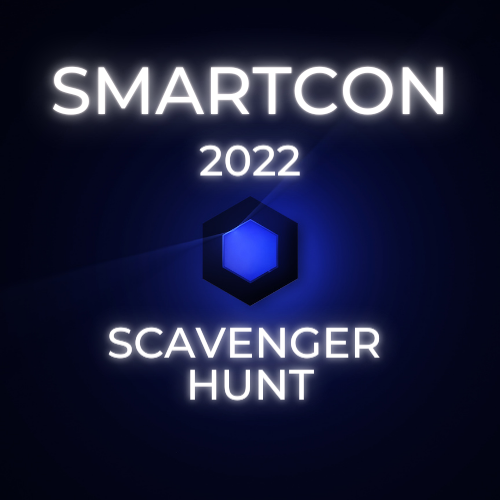
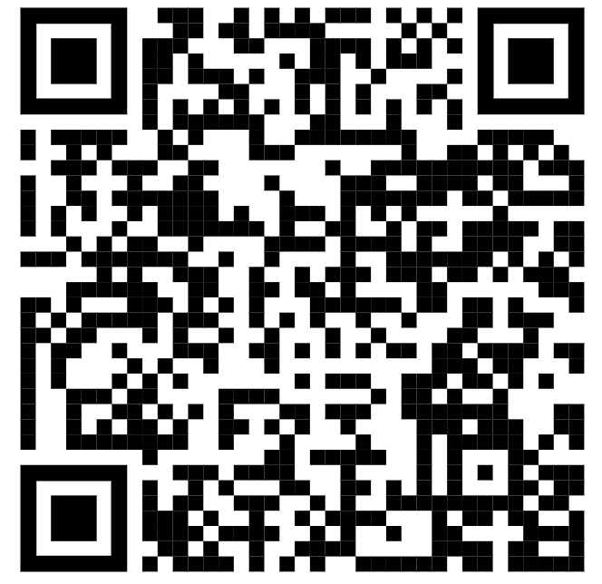

# SmartCon 2022 Scavenger Hunt

 

 

This repo QR Code

 

 

- There are 20 contracts with a “mintNft” or “mint_nft” function, find out how to mint each of the 20 NFTs
- Minting multiple NFTs from the same contract doesn’t get you extra points
- Contracts are unaudited, so if there is something that would prevent others from minting an NFT, let Patrick know
- No cheating allowed. Cheating is loosely defined. It can be anything from DDOSing competitors, attempting denial of service smart contract attacks, physically attacking other computers, etc. Patrick’s discretion.
- In order for your scores to count, you need to register your team on the registration contract
- There is a score function on the registration contract, that’s how you can know your score
- You are allowed to look at other people’s transactions

# Addresses

[Registration](https://goerli.etherscan.io/address/0xff3ba1e249b356638253c709c8338094b6d66eaf)

Register your team address (the addresses that will hold the NFTs) and a team name. This is how you will be scored.

## E

- [E1](https://goerli.etherscan.io/address/0xeD44562aD64731E4c407a34f7C181eF962dA8e89)
- [E2](https://goerli.etherscan.io/address/0x79526378aF06BbD1B6Af8628D58E5f4456565BF3)
- [E3](https://goerli.etherscan.io/address/0x7c32eb9cc143d8cef208824e048e762e3caf4919)
- [E4](https://goerli.etherscan.io/address/0x46B6c3446dc78517E61e59Ac76AB605dCCb1Dd7e)
- [E5](https://goerli.etherscan.io/address/0x59a9E94f3F9b874e1bB7319973AB6063E9b95380)
- [E6](https://goerli.etherscan.io/address/0xD547C52FDE4E1e2C17E5d3E3a6DA87990e922711)
- [E7](https://goerli.etherscan.io/address/0xf9Fce2937a71E83EBe43dfbc726B6212c9EB6106)

## M

- [M1](https://goerli.etherscan.io/address/0x8407C7686eA96760263ED11eC7EF059361e8CD27)
- [M2](https://goerli.etherscan.io/address/0x753A9fb74057384FA295a45020FEB978B5704257)
- [M3](https://goerli.etherscan.io/address/0xbF8d39024277C9aC32bc641aC955770f4a55Fd48)
- [M4](https://goerli.etherscan.io/address/0x9e7d621eFf380e701E9FA9B0b87f0D994A0B85d7)
- [M5](https://goerli.etherscan.io/address/0xED51f057E0D28A60e7a139bEFacdD79ADEb94c62)
- [M6](https://goerli.etherscan.io/address/0xf1a8b5dbdf8e92aa8574912d143d79504c96705e)
- [M7](https://goerli.etherscan.io/address/0x5CD7daDE9b8BD31416B5B550a67B8f79Caf3C4ba)
- [M8](https://goerli.etherscan.io/address/0xc1a4260BbDAf25Bb5916A4d03F8625604d7BFfeA)

## H

- [H1](https://goerli.etherscan.io/address/0xeb2bC2378A86Ee12e855f91fbD46f73CC2Ed664e)
- [H2](https://goerli.etherscan.io/address/0x35182E3182B08fe968B2619f6eE161Cd5f5CeFb1)
- [H3](https://goerli.etherscan.io/address/0xDA47cAdADC4B7ab574085D83cE1Ed9a375DdB743)
- [H4](https://goerli.etherscan.io/address/0x995722E755A4Ac0fF059F73205e8D27615705346)
- [H5](https://goerli.etherscan.io/address/0x9Bd77A04aCC33D26Ad5D1C58A20Ed56Ed32FcAA9)
